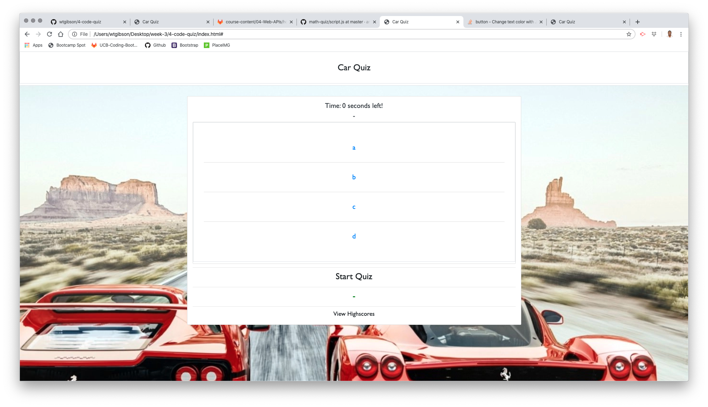

# 04 Web APIs: Code Quiz

## Summary 

The purpose of the assignment was to create a timed quiz which leveraged Javascript logic, functions, and variables which dynamically updated the user's score based on their performance, ultimately letting them save their initals and score.

```
User Story
AS A coding bootcamp student
I WANT to take a timed quiz on JavaScript fundamentals that stores high scores
SO THAT I can gauge my progress compared to my peers

Acceptance Criteria
GIVEN I am taking a code quiz
WHEN I click the start button
THEN a timer starts and I am presented with a question
WHEN I answer a question
THEN I am presented with another question
WHEN I answer a question incorrectly
THEN time is subtracted from the clock
WHEN all questions are answered or the timer reaches 0
THEN the game is over
WHEN the game is over
THEN I can save my initials and score
```

## Site Picture


## Technologies Used
- HTML - used to create elements on the DOM
- CSS - styles HTML elements on page
- Bootstrap - CSS framework directed at responsive, mobile first front-end web development
- JavaScript - provides dynamic interactivity on HTML documents
- Git - version control system to track changes to source code
- GitHub - hosts repository that can be deployed to GitHub Pages

## Code Snippet

Below is an example of a block of code in the JS file where most of the logic behind the quiz is stored. First I created a function enacted on the user's click on an answer choice checking it against the answer key to the question then displayed whether it was correct or incorrect in the result field and added or subtracted points accordingly. 

```js
answersElement.addEventListener("click", function(event) {
    console.log("answer chosen");
    var element = event.target;
    if (element.textContent !== quizQuestions[i].correct) {
        console.log(element)
        console.log("Wrong Answer")
        resultElement.textContent = "Incorrect!";
        console.log(resultElement.textContent)
        document.getElementById("result").style.color = 'red';            
        console.log(resultElement.style.color)

    } else {
        console.log(element)
        console.log("Right Answer")
        resultElement.textContent = "Correct!";
        console.log(resultElement.textContent)
        document.getElementById("result").style.color = 'green';            
        console.log(resultElement.style.color)
        userScore += 10
        console.log(userScore)

    }
    if (i < quizQuestions.length - 1) {
    i++;
    quiz();
    } else {
    clearInterval(timeInterval)    
    alert("Quiz Complete!");
    userScore += secondsLeft
    console.log(userScore)
    alert(userScore);
    endQuiz();
    restartQuiz();
    }
});
```

## Author Links

Will Gibson

[LinkedIn](https://www.linkedin.com/in/wtgibson/)

[GitHub](https://github.com/wtgibson/4-code-quiz)

Special thanks to Mahisha Gunasekaran, Kerwin Hy, and Jeremy Cantwell, and Brad Davis for their input and assistance with the assignment!